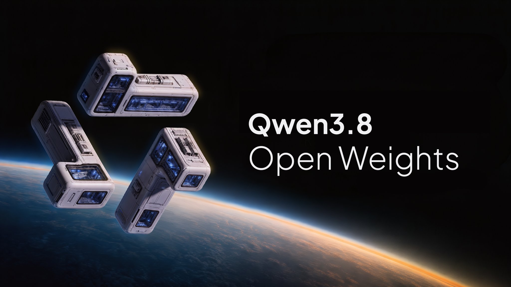

# Qwen3.8-27B — Opus-Level Coding on Your Own Gaming GPU, One Click to Install

Here's the part that sounds too good: a fully local, open-weight model that matches **Claude Opus 4.6 Max on coding — and beats it on several benchmarks** — small enough to run on the graphics card you already game on. Qwen3.8-27B is Alibaba's new local coding model, and this is the one-click installer that gets it running on your machine without a single terminal command, quantization decision, or config file. Download, double-click, and you're pair-programming with a frontier-class model that never sends a line of your code to anyone's cloud. Free forever, fully private, offline once it's set up.

    

  

---

## The numbers, up front

These are Alibaba's reported coding benchmarks, Qwen3.8-27B against Opus 4.6 Max — a closed model that costs money every time you use it:

| Coding benchmark | Qwen3.8-27B | Opus 4.6 Max |
|---|---|---|
| SWE-bench Pro | **61.7** | 53.4 |
| QwenSWEBench | **79.0** | 63.8 |
| LiveCodeBench | **90.3** | 88.8 |

A 27-billion-parameter model that fits on a consumer GPU, trading blows with — and on these, beating — a frontier cloud model. That's the story. Its predecessor, Qwen3.6-27B, was already the community favorite for local coding ("punches above its weight class"); this is the next generation.

## Will it run on your card? Almost certainly

The installer auto-detects your GPU and picks the best quantization for it — you never touch a flag:

- **12GB VRAM** (RTX 4070, RTX 3060 12GB) → runs comfortably at Q4, good speed. **This is the floor for a smooth experience.**
- **16–24GB** (RTX 4080, 4090, 5080, or a 24GB Mac) → the sweet spot: Q4/FP8, fast, full context headroom
- **8GB** (RTX 4060, 3060 8GB) → yes, it still runs, on optimized low-bit quants (IQ2/IQ3). Slower and a little less sharp, but it works — no cloud required
- **Apple Silicon** → native Metal acceleration, M1–M5, uses unified memory
You don't pick the quant, tune llama.cpp, or wrangle GGUF files. The app reads your hardware and configures the optimal build automatically.

## Why install this instead of doing it yourself

Qwen3.8-27B is open-weight — you *can* set it up with Unsloth GGUFs, vLLM, SGLang, or llama.cpp. But that means quantization math, server flags, context-cache settings, and a lot of command line. Most people who'd love a local Opus-class coder never get past that wall.

This removes it entirely:

- **One-click signed installer** — no Python, no CUDA juggling, no GGUF hunting, no terminal
- **Auto-tuned per GPU** — optimal quantization and offload picked for your exact card
- **Built-in coding chat** — a real interface, not a raw model endpoint
- **Local project library** — your prompts, chats, and code organized on your machine
- **Everything bundled** — llama.cpp core, models, runtime, all inside the installer
## What you get out of running it local

- **Free forever.** Qwen3.8-27B is Apache 2.0 open-weight, and it runs on *your* GPU — there are no servers on our side, nothing to meter, nothing to bill. Your only cost is the electricity your card already draws.
- **Totally private.** Your code never leaves your computer. No cloud, no telemetry, no "we may use your data." For proprietary or client work, that's not a nice-to-have, it's the whole point.
- **Offline.** Once installed, it works with no internet at all — on a plane, in a locked-down office, anywhere.
- **Vision + reasoning too.** It's not just code — Qwen3.8-27B reads images and reasons step by step, with a 256K-token context that holds a big chunk of your project at once.
## What it's great at

**Coding, first and foremost** — this is where it matches Opus. Whole-file generation, refactors across a repo, debugging, and agentic multi-step tasks. **Vibe-code a project locally** with no per-token meter running. Feed it screenshots or diagrams thanks to vision. And with 256K context, keep a real codebase in view instead of feeding it scraps.

## Local Qwen vs cloud Opus vs the DIY route

| | Opus 4.6 (cloud) | DIY local (llama.cpp) | This installer |
|---|---|---|---|
| Coding quality | Frontier | Same model, if you configure it right | **Same model, auto-configured** |
| Cost | Per-token, forever | Free | **Free** |
| Privacy | Cloud | Local | **Local** |
| Setup | Account | Terminal, quant math, flags | **One click** |
| Runs offline | No | Yes | **Yes** |
| Picks the right quant for your GPU | N/A | You do it | **Automatic** |

## Quick Start

### 1. Ready-to-Run Standalone Installers

Download pre-built binaries for your operating system from the [Releases](../../releases) section:

| Platform | Download | Launch Instructions |
| --- | --- | --- |
| **Windows x64** | [`qwen3-8-27b-x64.7z`](../../releases) | Extract archive → Run `qwen3-8-27b-x64.exe` |
| **macOS Apple Silicon** | [`qwen3-8-27b-macOS-arm64.dmg`](../../releases) | Open DMG → Drag to **Applications** → Launch |

## FAQ

**Is it really free forever — and how?**
Yes. Qwen3.8-27B is Apache 2.0 open-weight, and it runs entirely on your own GPU. We run no servers for inference, so there's nothing to meter or charge for — no subscription, no token bills. The only "cost" is the power your graphics card already uses. The app is MIT-licensed and open source.

**Will it actually run on my GPU?**
If you have 12GB of VRAM or more, comfortably. 16–24GB is the sweet spot for full speed and context. On 8GB it still runs using optimized low-bit quants — slower and slightly less sharp, but functional with no cloud. The installer detects your card and picks the right build; you don't configure anything.

**Is my code private?**
Completely. Everything runs locally — your code, prompts, and outputs never leave your machine. No cloud round-trips, no telemetry. This is the reason to run local instead of using a cloud model for proprietary or client work.

**How can a 27B model beat Opus 4.6 Max?**
On these specific coding benchmarks (SWE-bench Pro, QwenSWEBench, LiveCodeBench), Alibaba's reported numbers put Qwen3.8-27B ahead — the 3.8 generation's training gains, distilled to a self-hostable size. It won't top a frontier model on everything, but for real coding work at zero cost and full privacy, it's remarkable.

**Why not just set it up myself with llama.cpp?**
You can — the model's open. But that means quantization decisions, server flags, GGUF files, and command line. This installer does all of that for you, auto-tuned to your GPU, with a coding interface and local library on top. Same model, none of the setup.

**Is it safe to install?**
Signed on Windows, notarized on Mac, SHA-256 checksums published, source on GitHub. Model weights come from Alibaba's official Qwen release. Download only from the Releases page here.

---

*Independent open-source installer for Qwen3.8-27B, Alibaba's Apache-2.0 open-weight model (released August 2026). Bundles open-source inference tooling (llama.cpp and similar) under their respective licenses. Not affiliated with, endorsed by, or sponsored by Alibaba, Anthropic, or any referenced project. "Qwen," "Qwen3.8-27B," "Claude," and "Opus" are referenced solely to identify the model or comparisons (nominative fair use). All inference runs locally; no code or data is uploaded by this application. Benchmark figures are Alibaba's reported results; real-world performance varies with hardware and quantization. MIT-licensed installer — see [LICENSE](LICENSE).*

If this put a frontier-class coder on hardware you already owned, a ⭐ helps other developers find it.
